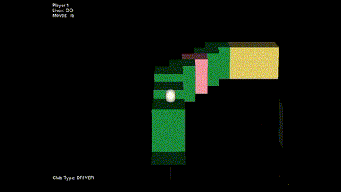

# 🏌️ Ubisoft NEXT Programming Challenge 2025 - Mini Golf Game
## 📺 YouTube Showcase
🎥 Watch Gameplay Demo: [YouTube Link](https://youtu.be/ENdJ8lNCyjQ)

## 🎮 Overview
This project was developed for the **Ubisoft NEXT Programming Challenge 2025**, and the given theme was mini-golf. The game is my interpretation of the classic mini-golf game, which I turned into 3D featuring physics-based mechanics, a third-person perspective, and puzzle elements. The game supports both **single-player** and **two-player modes**, encouraging players to complete the course with the fewest possible moves.

### 🛠️ Basic API Support
The provided API supports only fundamental functionalities, including:
- **Drawing Lines** for rendering graphics.
- **Playing Sounds** for in-game audio feedback.
- **Retrieving Player Input** to handle controls and interactions.

## 🏆 Gameplay
### 🎯 Objective
- Navigate through the **3D maze** and get the ball to the **destination** using the **fewest possible movements**.
- In **2-player mode**, players take turns shooting the ball, and the **first player to reach the destination wins**.
- Alternatively, if a player **loses all their lives**, the other player is declared the winner.

### 🎮 Controls
- **W**: Move Camera Forward  
- **S**: Move Camera Backward  
- **A**: Look Left  
- **D**: Look Right  
- **SPACE**: Hold to control intensity, release to shoot  
- **LShift/RShift**: Switch golf club type (PUTTER / DRIVER)  

### 🏌️‍♂️ Game Features
- **Two types of clubs**:  
  - **PUTTER**: Rolls the ball on the ground; controlled via a **power gauge**.  
  - **DRIVER**: Shoots the ball in a **projectile motion**; gauge bar determines the **angle of the shot** (10°–80°).  
- **Physics-Based Interactions**:  
  - The ball **bounces** upon collision.  
  - Different terrain types affect movement speed and friction.  
- **Variety of Blocks**:  
  - **Green Block**: Basic grass block.  
  - **Yellow Block**: Sand with higher friction.  
  - **Pink/Blue Portals**: Teleports the ball (cooldown: **8s / 20s multiplayer** for pink, **12s / 25s multiplayer** for blue).  
  - **Moving Blocks**: Obstructs or aids ball movement.  
  - **Goal Block**: Ends the game when reached.  
- **Multiplayer Mechanics**:  
  - Players **bounce off** each other in an **elastic collision**.  
  - Players **lose a life if they fall off the map** (max **3 lives per player**).  

## 🔧 Key Engine Features

### ⚙️ ECS & Memory Management
- **Entity Component System (ECS) in ECS Folder**:
  - Uses a **MemoryPool** for optimized component storage.
  - Implements a **Bounding Volume Hierarchy (BVH)** for efficient **collision detection**.
  - Designed to be **cache-friendly**, minimizing **heap allocations**.

### 🎨 3D Graphics Pipeline
- **Implemented in Graphics/Renderer.cpp**
 1. Affine Transformations: Scale, Translate, and Rotate coordinates in object space.
 2. Backface Culling: Using the direction of the camera forward and position, skip coordinates at the back
 3. View Matrix Transformation: Converts coordinates into camera view space.
 4. Perspective Transformation: Changes coordinates into a frustum, making objects appear larger when closer.
 5. Orthographic Transformation: Converts coordinates into a normalized clip space between -1 and 1 (NDC).
 6. Frustum Culling: Skip coordinates outside the range of -1 to 1
 7. Viewport Transformation: Scale and transform the points between -1 to 1 to fit the actual screen
 8. Triangle Rasterization: Using ambient + di use lighting to determine the colour of each triangle and colour the triangle
 9. 
### 🎨 Rasterization
- **Implemented in Graphics/Renderer.cpp**
- **Scanline Method**: Renders triangles by interpolating values along the **y-axis**.
- **Pineda's Algorithm** ([Reference](https://www.cs.drexel.edu/~deb39/Classes/Papers/comp175-06-pineda.pdf)):
  - Determines **triangle fill points** and checks if points are inside.
  - Intended for **parallel processing**, but future improvements are needed.
- **Custom Rendering API**: No **direct OpenGL calls**, uses `App::DrawLine`.

### 🏗️ Physics & Collision Handling
- **Dynamic Bounding Volume Hierarchy (BVH) in Physics/BVH**
- **Built Bottom-Up**: Divides the tree using **the median of the longest axis**.
- **Optimized for Static Objects**: Avoids **worst-case n-length tree**.
- **Collision Detection Complexity**: Improved from **O(n) → O(log n)**.
- **Memory Optimization**:
  - **Pre-allocates** BVH nodes.
  - **Reuses deleted node positions** to avoid **memory fragmentation**.

## 🚀 Challenges & Solutions

### 🎭 Multiplayer Implementation Issues
- **Players had multiple lives**, causing issues with **respawning and disappearing unexpectedly**.
- **Turn mechanics were broken**: Players could shoot **while the ball was still moving**.

### ✅ Solutions Implemented
- Divided the **game scene into two states**:
  1. **One ball exists**
  2. **Two balls exist**
- Ensured **turn-based mechanics** by **tracking both ball states** and **waiting until both are at rest** before switching turns.

## 🔮 Future Improvements
- Implement **parallel processing** in **rasterization**.
- Enhance **BVH dynamic updates** to further reduce computation overhead.
- Implement **networked multiplayer** for broader player engagement.

